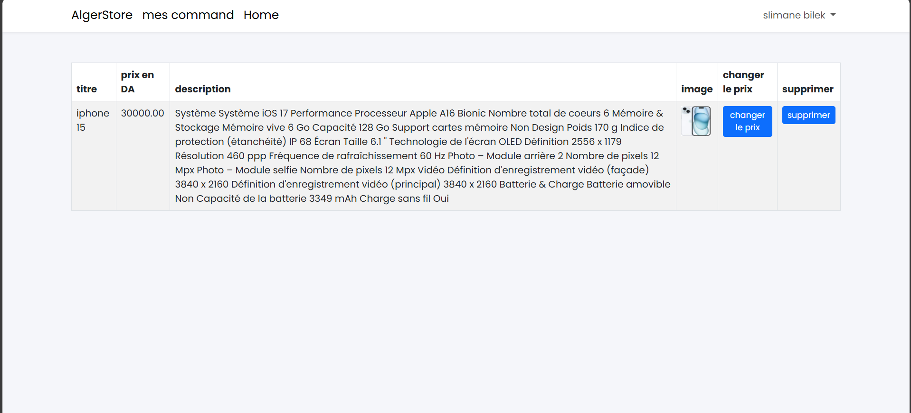

projet de site e-commerce avec PHP laravel# AlgerStore - Projet E-commerce avec Laravel

## Description
AlgerStore est une plateforme de commerce en ligne développée en PHP avec Laravel. Ce projet utilise une base de données MySQL gérée via phpMyAdmin. Il permet aux utilisateurs de s'inscrire, se connecter, ajouter des produits à vendre, consulter leurs produits et leurs commandes.

## Technologies Utilisées
- **Laravel** - Framework PHP
- **MySQL** - Base de données
- **phpMyAdmin** - Gestion de la base de données
- **Blade** - Moteur de template de Laravel

## Fonctionnalités Principales
1. **Inscription et connexion des utilisateurs**
2. **Page d'accueil**
3. **Ajout de produits à vendre**
4. **Consultation des produits disponibles**
5. **Gestion des commandes**

## Aperçu du Projet
Voici les captures d'écran du projet, illustrant les différentes fonctionnalités du site :

1. **Page d'accueil**
   

2. **Page d'inscription**
   

3. **Page de connexion**
   

4. **Utilisateur connecté**
   

5. **Tableau de bord (Home)**
   

6. **Ajout d'un produit à vendre**
   

7. **Liste des produits**
   

8. **Liste des commandes**
   

## Installation

### 1. Cloner le projet
```bash
 git clone https://github.com/votre-repo/algerstore.git
 cd algerstore
```

### 2. Installer les dépendances
```bash
composer install
npm install
```

### 3. Configurer l'environnement
Copiez le fichier `.env.example` en `.env` et configurez votre base de données :
```ini
DB_CONNECTION=mysql
DB_HOST=127.0.0.1
DB_PORT=3306
DB_DATABASE=algerstore_db
DB_USERNAME=root
DB_PASSWORD=
```
Puis exécutez :
```bash
php artisan key:generate
php artisan migrate --seed
```

### 4. Lancer le serveur
```bash
php artisan serve
```
Le site sera accessible sur `http://127.0.0.1:8000`

## Contribution
Les contributions sont les bienvenues ! Veuillez suivre les règles de commit et proposer vos pull requests.

## Licence
Ce projet est sous licence MIT.

---
Projet réalisé par **Bilek Slimane**

